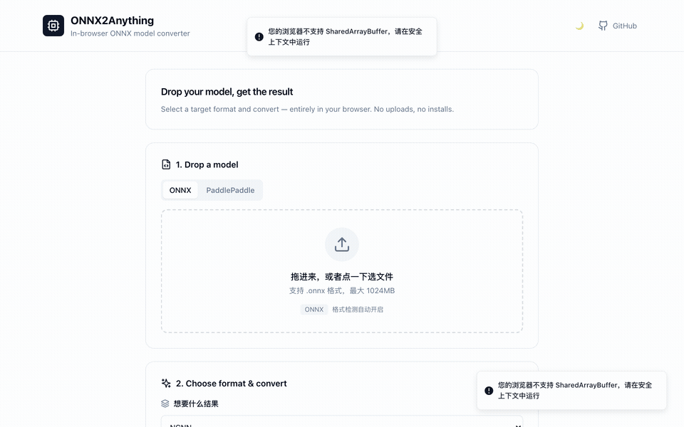

<div align="center">

# ONNX2Anything

**Convert ONNX models to any edge inference format — entirely in your browser.**

No installation. No server. No uploads. Your model never leaves your machine.

[](https://opensource.org/licenses/MIT)
[](CONTRIBUTING.md)
[](https://github.com/UnstoppableCurry/onnx2anything)
[](https://github.com/UnstoppableCurry/onnx2anything/fork)
[](https://github.com/UnstoppableCurry/onnx2anything/issues)

**[🌐 Live Demo →](https://onnx2anything.com)** · [Report Bug](https://github.com/UnstoppableCurry/onnx2anything/issues) · [Request Format](https://github.com/UnstoppableCurry/onnx2anything/issues/new?template=format-request.md)

</div>

---

## Demo

> **Drop an ONNX model → select target format → download in seconds — all in-browser, zero server.**

<!-- TODO: Replace with animated GIF recording (15s: drag model → select NCNN → convert → download) -->
<!-- To record: open https://onnx2anything.com, use QuickTime/ScreenToGif, save as docs/demo.gif -->



*↑ Try it yourself at [onnx2anything.com](https://onnx2anything.com)*

---

## Why ONNX2Anything?

Most ONNX conversion tools require you to:
- Install SDKs, Python environments, and native compilers
- Upload your model to a remote server (privacy risk)
- Learn different CLIs for each target framework

**ONNX2Anything does all of this in the browser** using WebAssembly. Open the page, drop your model, download the result. Done.

---

## Supported Formats

| Format | Status | Description |
|--------|--------|-------------|
| **NCNN** | ✅ Ready | Tencent's high-performance mobile inference — Android / iOS / ARM Linux |
| **MNN** | ✅ Ready | Alibaba's lightweight inference — mobile & desktop (FP16 / INT8) |
| **TNN** | ✅ Ready | Tencent's cross-platform inference — Android / iOS / macOS |
| **Tengine** | ✅ Ready | OAID lightweight inference for IoT and embedded AI chips |
| **Paddle Lite** | ✅ Ready | Baidu's edge inference — ARM / Android / iOS (outputs `.nb`) |
| **TFLite** | 🚧 Coming | Google's mobile-first inference for Android / embedded / microcontrollers |
| **CoreML** | 🔜 Planned | Apple's native inference — iOS / macOS / watchOS |
| **OpenVINO** | 🔜 Planned | Intel OpenVINO IR — CPU / GPU / NPU on Intel hardware |

> All conversions run as **WebAssembly modules** inside a Web Worker. Zero network traffic, zero telemetry.

---

## 🚀 Help Wanted

**TFLite and CoreML are the #1 most-requested formats** and we need contributors who can compile C++ to WebAssembly with Emscripten.

Each format is self-contained (~200 lines of bridge code). See [CONTRIBUTING.md](CONTRIBUTING.md) for the exact steps. If you've built WASM modules before, you can add a format in a weekend.

👉 **[Open issues labeled `help wanted`](https://github.com/UnstoppableCurry/onnx2anything/issues?q=is%3Aopen+label%3A%22help+wanted%22)**

---

## Features

- 🔒 **Privacy-first** — your model never leaves your browser
- ⚡ **Zero install** — runs in any modern browser, no Python, no SDK
- 🔄 **ONNX Simplifier** — optional pre-processing to canonicalize your graph
- 🎯 **Quantization** — FP16 / INT8 options per framework
- 🏗️ **PaddlePaddle input** — convert `.pdmodel` + `.pdiparams` via built-in paddle2onnx step
- 📦 **Batch-ready architecture** — designed to support CI/API usage in future

---

## Quick Start

```bash
# Prerequisites: Node.js 18+, pnpm
git clone https://github.com/UnstoppableCurry/onnx2anything.git
cd onnx2anything
pnpm install
cd apps/web && pnpm dev
# Open http://localhost:5173
```

---

## How It Works

```
Browser
  └── React UI
        └── Web Worker
              ├── Pyodide (Python 3.11 WASM) — onnxsim, paddle2onnx
              └── Per-format WASM modules
                    ├── onnx2ncnn.wasm  + ncnnoptimize.wasm
                    ├── MNNConvert.wasm
                    ├── TnnConverter.wasm
                    ├── TengineConvert.wasm
                    └── paddle_lite_opt.wasm
```

Your model is written to an in-memory virtual filesystem inside the Worker. The WASM tool reads it, converts it, and the result is streamed back to your browser for download. **Nothing touches the network.**

---

## Project Structure

```
onnx2anything/
├── apps/
│   └── web/                  # React frontend (Vite + TypeScript)
│       ├── src/
│       │   ├── workers/      # converter.worker.ts — WASM orchestration
│       │   └── components/   # UI components
│       └── public/
│           └── toolchains/   # WASM binaries + .mjs bridge modules
├── scripts/                  # Build & toolchain scripts
├── third_party/              # NCNN, MNN, TNN, Tengine, Paddle-Lite sources
├── tests/
│   ├── e2e/                  # Playwright end-to-end tests
│   └── unit/                 # Vitest unit tests
└── docs/                     # Additional documentation
```

---

## Adding a New Format

Each output format is a self-contained module in `apps/web/public/toolchains/modules/`:

```javascript
// apps/web/public/toolchains/modules/myformat.mjs
export function register(context) {
  context.register({
    id: 'myformat',
    async convert(modelBuffer, options) {
      // Load your WASM module, write modelBuffer to FS, call main, read output
      return { success: true, data: outputBuffer };
    },
  });
}
```

Then add an entry to `manifest.json` and your format appears in the UI automatically. See [CONTRIBUTING.md](CONTRIBUTING.md) for the full guide.

---

## Development

```bash
# Run tests
pnpm test              # unit tests (Vitest)
pnpm test:e2e          # e2e tests (Playwright, requires pnpm dev running)

# Build
cd apps/web && pnpm build

# Build a WASM toolchain (requires Docker / Lima VM)
bash scripts/build-edge-toolchain.sh ncnn
```

---

## Roadmap

- [ ] TFLite (ONNX → `.tflite`) via Emscripten-compiled `flatc` + converter
- [ ] CoreML (ONNX → `.mlpackage`) via `coremltools` in Pyodide
- [ ] OpenVINO browser WASM (`ovc.wasm`)
- [ ] RKNN (Rockchip NPU)
- [ ] Batch conversion (multiple models)
- [ ] GitHub Actions integration
- [ ] REST API / CLI wrapper

---

## Contributing

Contributions are very welcome — especially new format modules!

Please read [CONTRIBUTING.md](CONTRIBUTING.md) before opening a PR.

---

## License

MIT © [UnstoppableCurry](https://github.com/UnstoppableCurry)

---

## Star History

[](https://star-history.com/#UnstoppableCurry/onnx2anything&Date)

---

<div align="center">
<sub>Built with ❤️ using WebAssembly, Pyodide, React, and a lot of Emscripten patience.</sub>
</div>
